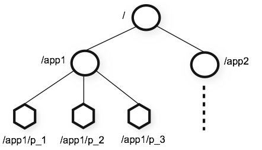
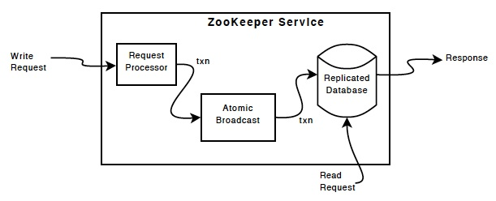
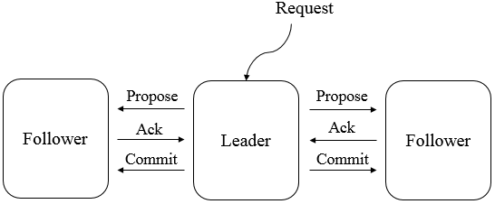

# Zookeeper简介及核心概念

<nav>
<a href="#一Zookeeper简介">一、Zookeeper简介</a> 
<a href="#二Zookeeper设计目标">二、Zookeeper设计目标</a> 
<a href="#三核心概念">三、核心概念</a> 
&nbsp;&nbsp;&nbsp;&nbsp;&nbsp;&nbsp;&nbsp;&nbsp;<a href="#31-集群角色">3.1 集群角色</a> 
&nbsp;&nbsp;&nbsp;&nbsp;&nbsp;&nbsp;&nbsp;&nbsp;<a href="#32-会话">3.2 会话</a> 
&nbsp;&nbsp;&nbsp;&nbsp;&nbsp;&nbsp;&nbsp;&nbsp;<a href="#33-数据节点">3.3 数据节点</a> 
&nbsp;&nbsp;&nbsp;&nbsp;&nbsp;&nbsp;&nbsp;&nbsp;<a href="#34-节点信息">3.4 节点信息</a> 
&nbsp;&nbsp;&nbsp;&nbsp;&nbsp;&nbsp;&nbsp;&nbsp;<a href="#35-Watcher">3.5 Watcher</a> 
&nbsp;&nbsp;&nbsp;&nbsp;&nbsp;&nbsp;&nbsp;&nbsp;<a href="#36-ACL">3.6 ACL</a> 
<a href="#四ZAB协议">四、ZAB协议</a> 
&nbsp;&nbsp;&nbsp;&nbsp;&nbsp;&nbsp;&nbsp;&nbsp;<a href="#41-ZAB协议与数据一致性">4.1 ZAB协议与数据一致性</a> 
&nbsp;&nbsp;&nbsp;&nbsp;&nbsp;&nbsp;&nbsp;&nbsp;<a href="#42--ZAB协议的内容">4.2  ZAB协议的内容</a> 
<a href="#五Zookeeper的典型应用场景">五、Zookeeper的典型应用场景</a> 
&nbsp;&nbsp;&nbsp;&nbsp;&nbsp;&nbsp;&nbsp;&nbsp;<a href="#51数据的发布订阅">5.1数据的发布/订阅</a> 
&nbsp;&nbsp;&nbsp;&nbsp;&nbsp;&nbsp;&nbsp;&nbsp;<a href="#52-命名服务">5.2 命名服务</a> 
&nbsp;&nbsp;&nbsp;&nbsp;&nbsp;&nbsp;&nbsp;&nbsp;<a href="#53-Master选举">5.3 Master选举</a> 
&nbsp;&nbsp;&nbsp;&nbsp;&nbsp;&nbsp;&nbsp;&nbsp;<a href="#54-分布式锁">5.4 分布式锁</a> 
&nbsp;&nbsp;&nbsp;&nbsp;&nbsp;&nbsp;&nbsp;&nbsp;<a href="#55-集群管理">5.5 集群管理</a> 
</nav>

## 一、Zookeeper简介

Zookeeper 是一个开源的分布式协调服务，目前由 Apache 进行维护。Zookeeper 可以用于实现分布式系统中常见的发布/订阅、负载均衡、命令服务、分布式协调/通知、集群管理、Master 选举、分布式锁和分布式队列等功能。它具有以下特性：

+ **顺序一致性**：从一个客户端发起的事务请求，最终都会严格按照其发起顺序被应用到 Zookeeper 中；
+ **原子性**：所有事务请求的处理结果在整个集群中所有机器上都是一致的；不存在部分机器应用了该事务，而另一部分没有应用的情况；
+ **单一视图**：所有客户端看到的服务端数据模型都是一致的；
+ **可靠性**：一旦服务端成功应用了一个事务，则其引起的改变会一直保留，直到被另外一个事务所更改；
+ **实时性**：一旦一个事务被成功应用后，Zookeeper 可以保证客户端立即可以读取到这个事务变更后的最新状态的数据。

## 二、Zookeeper设计目标

Zookeeper 致力于为那些高吞吐的大型分布式系统提供一个高性能、高可用、且具有严格顺序访问控制能力的分布式协调服务。它具有以下四个目标：

### 2.1 目标一：简单的数据模型

Zookeeper 通过树形结构来存储数据，它由一系列被称为 ZNode 的数据节点组成，类似于常见的文件系统。不过和常见的文件系统不同，Zookeeper 将数据全量存储在内存中，以此来实现高吞吐，减少访问延迟。

### 2.2 目标二：构建集群

可以由一组 Zookeeper 服务构成 Zookeeper 集群，集群中每台机器都会单独在内存中维护自身的状态，并且每台机器之间都保持着通讯，只要集群中有半数机器能够正常工作，那么整个集群就可以正常提供服务。

### 2.3 目标三：顺序访问

对于来自客户端的每个更新请求，Zookeeper 都会分配一个全局唯一的递增 ID，这个 ID 反映了所有事务请求的先后顺序。

### 2.4 目标四：高性能高可用

ZooKeeper 将数据存全量储在内存中以保持高性能，并通过服务集群来实现高可用，由于 Zookeeper 的所有更新和删除都是基于事务的，所以其在读多写少的应用场景中有着很高的性能表现。

## 三、核心概念

### 3.1 集群角色

Zookeeper 集群中的机器分为以下三种角色：

+ **Leader** ：为客户端提供读写服务，并维护集群状态，它是由集群选举所产生的；
+ **Follower** ：为客户端提供读写服务，并定期向 Leader 汇报自己的节点状态。同时也参与写操作“过半写成功”的策略和 Leader 的选举；
+ **Observer** ：为客户端提供读写服务，并定期向 Leader 汇报自己的节点状态，但不参与写操作“过半写成功”的策略和 Leader 的选举，因此 Observer 可以在不影响写性能的情况下提升集群的读性能。

### 3.2 会话

Zookeeper 客户端通过 TCP 长连接连接到服务集群，会话 (Session) 从第一次连接开始就已经建立，之后通过心跳检测机制来保持有效的会话状态。通过这个连接，客户端可以发送请求并接收响应，同时也可以接收到 Watch 事件的通知。

关于会话中另外一个核心的概念是 sessionTimeOut(会话超时时间)，当由于网络故障或者客户端主动断开等原因，导致连接断开，此时只要在会话超时时间之内重新建立连接，则之前创建的会话依然有效。

### 3.3 数据节点

Zookeeper 数据模型是由一系列基本数据单元 `Znode`(数据节点) 组成的节点树，其中根节点为 `/`。每个节点上都会保存自己的数据和节点信息。Zookeeper 中节点可以分为两大类：

+ **持久节点** ：节点一旦创建，除非被主动删除，否则一直存在；
+ **临时节点** ：一旦创建该节点的客户端会话失效，则所有该客户端创建的临时节点都会被删除。

临时节点和持久节点都可以添加一个特殊的属性：`SEQUENTIAL`，代表该节点是否具有递增属性。如果指定该属性，那么在这个节点创建时，Zookeeper 会自动在其节点名称后面追加一个由父节点维护的递增数字。

### 3.4 节点信息

每个 ZNode 节点在存储数据的同时，都会维护一个叫做 `Stat` 的数据结构，里面存储了关于该节点的全部状态信息。如下：

| **状态属性**   | **说明**                                                     |
| -------------- | ------------------------------------------------------------ |
| czxid          | 数据节点创建时的事务 ID                                       |
| ctime          | 数据节点创建时的时间                                         |
| mzxid          | 数据节点最后一次更新时的事务 ID                               |
| mtime          | 数据节点最后一次更新时的时间                                 |
| pzxid          | 数据节点的子节点最后一次被修改时的事务 ID                     |
| cversion       | 子节点的更改次数                                             |
| version        | 节点数据的更改次数                                           |
| aversion       | 节点的 ACL 的更改次数                                          |
| ephemeralOwner | 如果节点是临时节点，则表示创建该节点的会话的 SessionID；如果节点是持久节点，则该属性值为 0 |
| dataLength     | 数据内容的长度                                               |
| numChildren    | 数据节点当前的子节点个数                                     |

### 3.5 Watcher

Zookeeper 中一个常用的功能是 Watcher(事件监听器)，它允许用户在指定节点上针对感兴趣的事件注册监听，当事件发生时，监听器会被触发，并将事件信息推送到客户端。该机制是 Zookeeper 实现分布式协调服务的重要特性。

### 3.6 ACL

Zookeeper 采用 ACL(Access Control Lists) 策略来进行权限控制，类似于 UNIX 文件系统的权限控制。它定义了如下五种权限：

- **CREATE**：允许创建子节点；
- **READ**：允许从节点获取数据并列出其子节点；
- **WRITE**：允许为节点设置数据；
- **DELETE**：允许删除子节点；
- **ADMIN**：允许为节点设置权限。

## 四、ZAB协议

### 4.1 ZAB协议与数据一致性

ZAB 协议是 Zookeeper 专门设计的一种支持崩溃恢复的原子广播协议。通过该协议，Zookeepe 基于主从模式的系统架构来保持集群中各个副本之间数据的一致性。具体如下：

Zookeeper 使用一个单一的主进程来接收并处理客户端的所有事务请求，并采用原子广播协议将数据状态的变更以事务 Proposal 的形式广播到所有的副本进程上去。如下图：

具体流程如下：

所有的事务请求必须由唯一的 Leader 服务来处理，Leader 服务将事务请求转换为事务 Proposal，并将该 Proposal 分发给集群中所有的 Follower 服务。如果有半数的 Follower 服务进行了正确的反馈，那么 Leader 就会再次向所有的 Follower 发出 Commit 消息，要求将前一个 Proposal 进行提交。

### 4.2  ZAB协议的内容

ZAB 协议包括两种基本的模式，分别是崩溃恢复和消息广播：

#### 1. 崩溃恢复

当整个服务框架在启动过程中，或者当 Leader 服务器出现异常时，ZAB 协议就会进入恢复模式，通过过半选举机制产生新的 Leader，之后其他机器将从新的 Leader 上同步状态，当有过半机器完成状态同步后，就退出恢复模式，进入消息广播模式。

#### 2. 消息广播

ZAB 协议的消息广播过程使用的是原子广播协议。在整个消息的广播过程中，Leader 服务器会每个事物请求生成对应的 Proposal，并为其分配一个全局唯一的递增的事务 ID(ZXID)，之后再对其进行广播。具体过程如下：

Leader 服务会为每一个 Follower 服务器分配一个单独的队列，然后将事务 Proposal 依次放入队列中，并根据 FIFO(先进先出) 的策略进行消息发送。Follower 服务在接收到 Proposal 后，会将其以事务日志的形式写入本地磁盘中，并在写入成功后反馈给 Leader 一个 Ack 响应。当 Leader 接收到超过半数 Follower 的 Ack 响应后，就会广播一个 Commit 消息给所有的 Follower 以通知其进行事务提交，之后 Leader 自身也会完成对事务的提交。而每一个 Follower 则在接收到 Commit 消息后，完成事务的提交。

## 五、Zookeeper的典型应用场景

### 5.1数据的发布/订阅

数据的发布/订阅系统，通常也用作配置中心。在分布式系统中，你可能有成千上万个服务节点，如果想要对所有服务的某项配置进行更改，由于数据节点过多，你不可逐台进行修改，而应该在设计时采用统一的配置中心。之后发布者只需要将新的配置发送到配置中心，所有服务节点即可自动下载并进行更新，从而实现配置的集中管理和动态更新。

Zookeeper 通过 Watcher 机制可以实现数据的发布和订阅。分布式系统的所有的服务节点可以对某个 ZNode 注册监听，之后只需要将新的配置写入该 ZNode，所有服务节点都会收到该事件。

### 5.2 命名服务

在分布式系统中，通常需要一个全局唯一的名字，如生成全局唯一的订单号等，Zookeeper 可以通过顺序节点的特性来生成全局唯一 ID，从而可以对分布式系统提供命名服务。

### 5.3 Master选举

分布式系统一个重要的模式就是主从模式 (Master/Salves)，Zookeeper 可以用于该模式下的 Matser 选举。可以让所有服务节点去竞争性地创建同一个 ZNode，由于 Zookeeper 不能有路径相同的 ZNode，必然只有一个服务节点能够创建成功，这样该服务节点就可以成为 Master 节点。

### 5.4 分布式锁

可以通过 Zookeeper 的临时节点和 Watcher 机制来实现分布式锁，这里以排它锁为例进行说明：

分布式系统的所有服务节点可以竞争性地去创建同一个临时 ZNode，由于 Zookeeper 不能有路径相同的 ZNode，必然只有一个服务节点能够创建成功，此时可以认为该节点获得了锁。其他没有获得锁的服务节点通过在该 ZNode 上注册监听，从而当锁释放时再去竞争获得锁。锁的释放情况有以下两种：

+ 当正常执行完业务逻辑后，客户端主动将临时 ZNode 删除，此时锁被释放；
+ 当获得锁的客户端发生宕机时，临时 ZNode 会被自动删除，此时认为锁已经释放。

当锁被释放后，其他服务节点则再次去竞争性地进行创建，但每次都只有一个服务节点能够获取到锁，这就是排他锁。

### 5.5 集群管理

Zookeeper 还能解决大多数分布式系统中的问题：

+ 如可以通过创建临时节点来建立心跳检测机制。如果分布式系统的某个服务节点宕机了，则其持有的会话会超时，此时该临时节点会被删除，相应的监听事件就会被触发。
+ 分布式系统的每个服务节点还可以将自己的节点状态写入临时节点，从而完成状态报告或节点工作进度汇报。
+ 通过数据的订阅和发布功能，Zookeeper 还能对分布式系统进行模块的解耦和任务的调度。
+ 通过监听机制，还能对分布式系统的服务节点进行动态上下线，从而实现服务的动态扩容。

 

